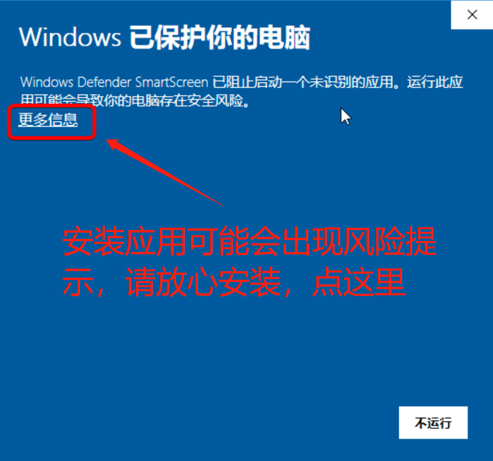
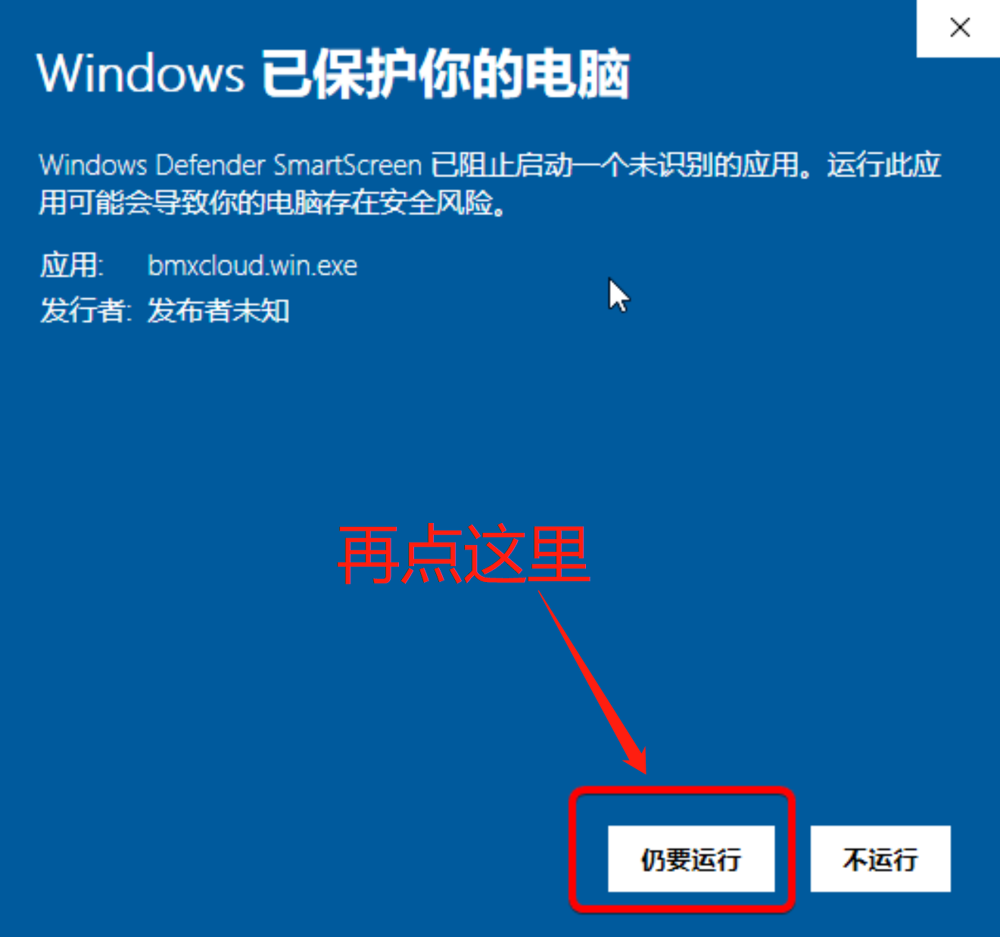
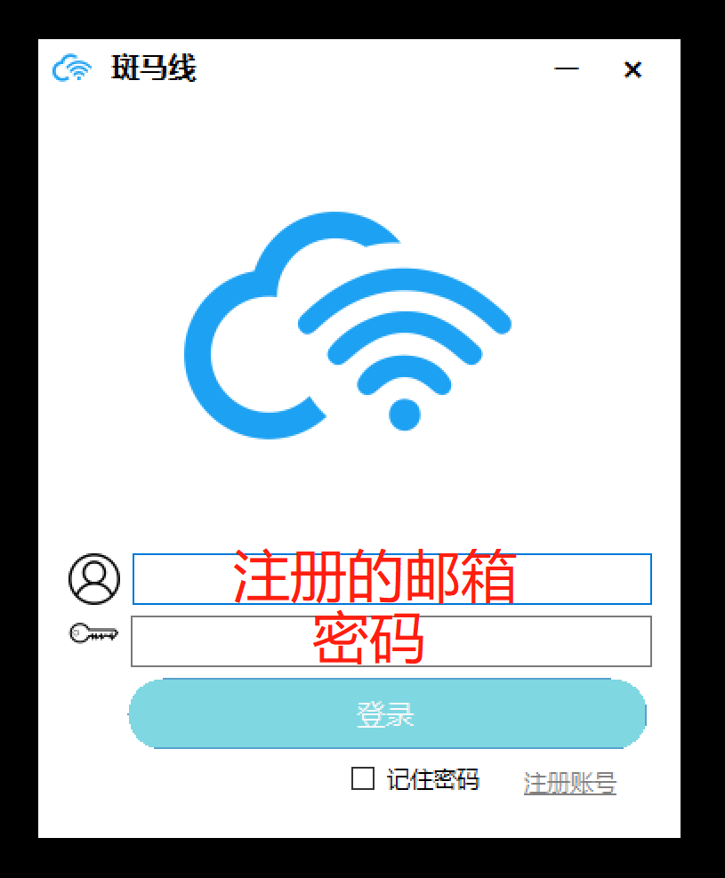
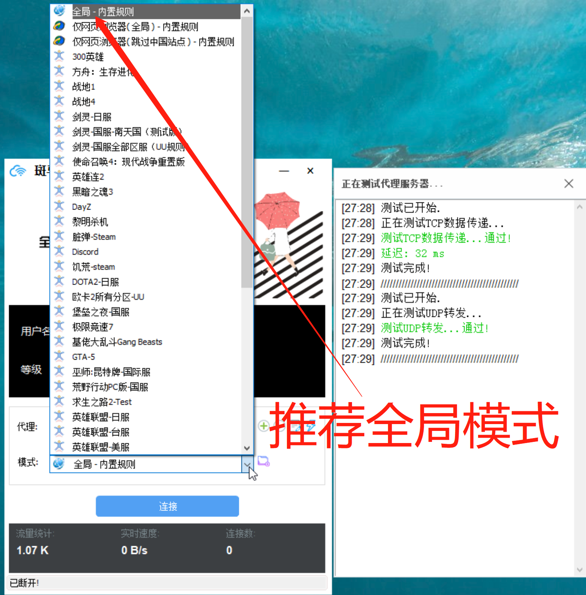
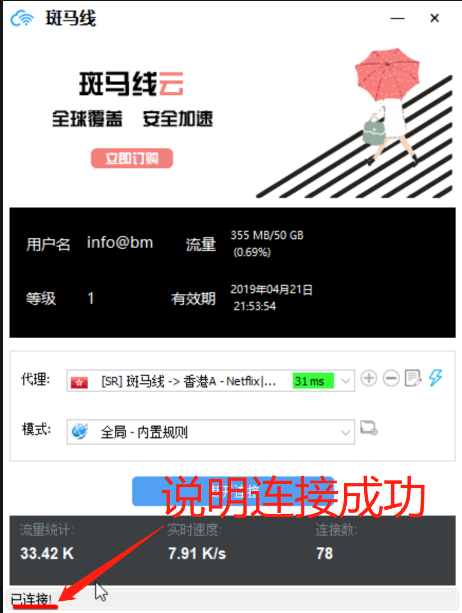

# PC电脑 - 斑马线

## [注意事项](https://bmxcloud.pro)

[**已经好评的记得加售后QQ群**](https://bmxcloud.pro)**：**679066245

[**有任何问题联系群管理员**](https://bmxcloud.pro)

[ **淘宝不做任何回复**](https://bmxcloud.pro) ****

## 软件下载

#### [点击下载](https://www.lanzous.com/bmxcloudwin) 

## 已知问题

* 登录失败：账户密码正确的情况下，出现这问题的以北方客户以及移动客户居多，如果手机版本正常可用，通常来说是本地运营商网络污染，360“安全”，QQ“安全”的系统污染导致，由于我们服务器在海外，反复尝试不行的话，请移步使用[第三方工具SStap](https://bmx168.com/other/sstap.html)或 [ShadowsocksR](https://bmx168.com/other/ssr.html)
* 缺少安装文件：Win7老版，特别是Ghost安装的Win7会出这个情况，请移步使用[第三方工具SStap](https://bmx168.com/other/sstap.html)或[ShadowsocksR](https://bmx168.com/other/ssr.html)
* WindowsXP系统：请使用[ShadowsocksR老版本](https://bmx168.com/other/ssr.html)
* 模式空白：小概率情况模式位置会出现空白，重启可以解决
* .Netframework4未安装：Windows7以及以下版本容易出现这个问题，原因是安装了不完整系统，请移步微软下载 .Netframework4并安装，跳转链接：[https://www.microsoft.com/zh-cn/download/details.aspx?id=17718](https://www.microsoft.com/zh-cn/download/details.aspx?id=17718)

## 使用教程

## 

